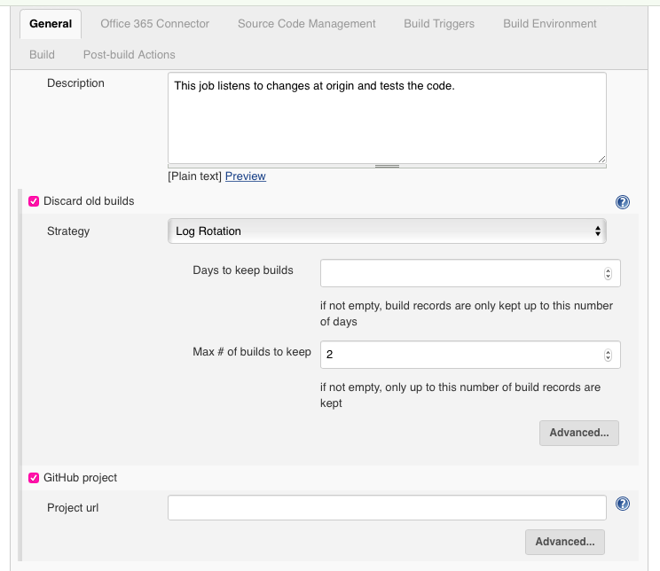
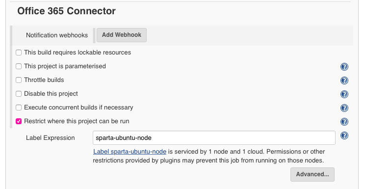
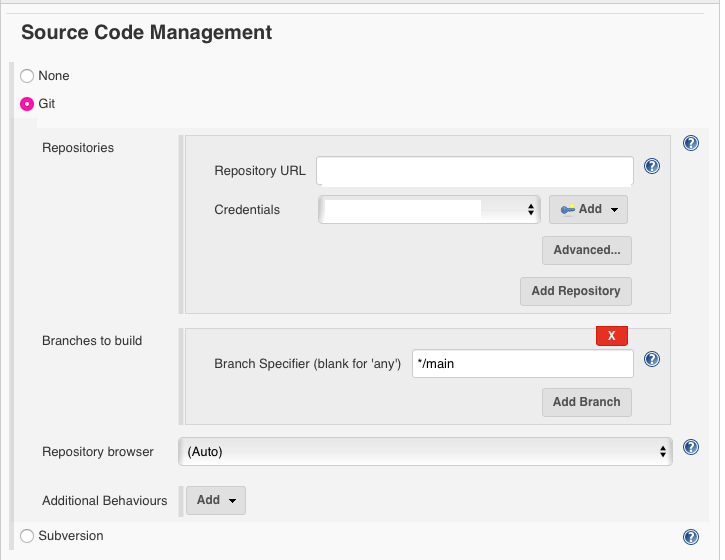
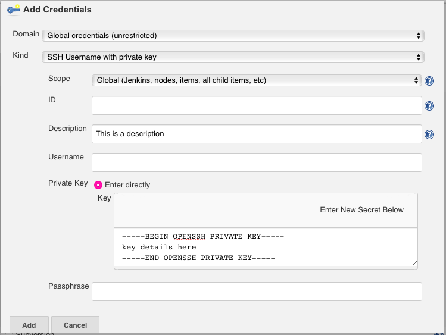
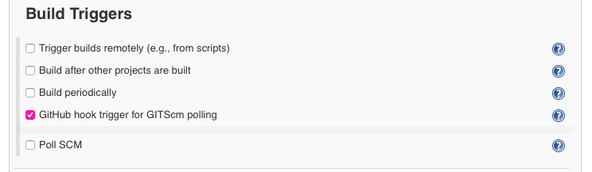
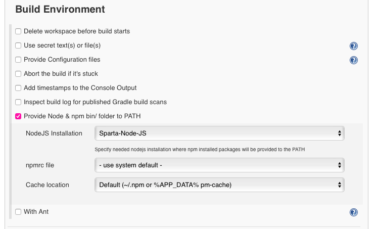
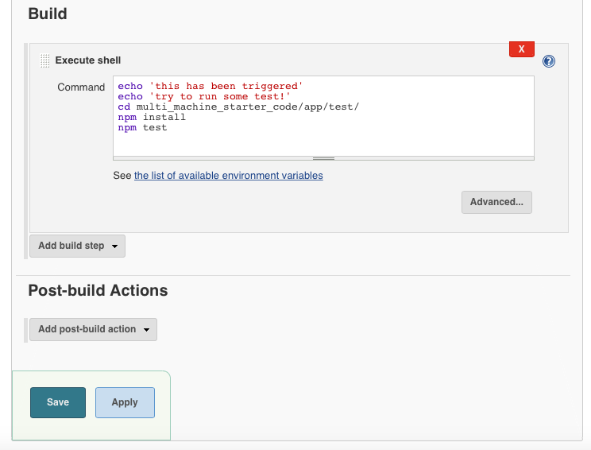

# Jenkins Setup
1. Navigate to the repository via the terminal and on GitHub.
1. Navigate to the ip address
2. Login, creating a new user if necessary.
3. Click on 'new item'. Use good naming convention to give a name and then click 'freestyle project' and 'ok'.
4. Proceed to configure the file.  
  * **General**
    * Write a description (optional)
    * Check the box marked 'discard old builds' and set the 'max # of build to keep' to an appropriate value e.g. 2
    * Check the box marked 'GitHub project' and paste the url of your GitHub repository.
    
  * **Office 365 Connector**
    * Check the box marked 'restrict where this project can be run' and type sparta-ubuntu-node (N.B Begin typing and this should show in the drop down. It may require re-selecting to get rid of errors.)
    
  * **Source Code Management**    
    * Check the box marked 'Git'      
         
    * In 'Repository URL' add the ssh key of the repository you wish to link. This can be accessed via clicking 'code' on the home page of the repository. Select ssh and copy the key. This will throw an error. Proceed to 'Credentials'
    * Click the 'Add' button beside 'Credentials'. This will enable you to create a new key.
    * Prior to doing so, generate a new ssh key in the terminal:
    ```bash
    # Navigate to location of keys
    cd ~/.ssh
    # Generate a new key
    ssh-keygen -t ed25519
    # Check the key has been created
    ls
    ```
    * Make note of the passphrase (f any)
    * Run `cat <key_name>` to get the private key. Copy this and refer back to Jenkins 'Add Credentials'. For 'kind' select 'SSH Username with Private Key'. Add a 'description' (optional). Paste the private key in the field marked 'Private Key'. The Username and Passphrase were both left empty for this key however, if this is not the case, add as required.  
    
    * Go back to the terminal and run `cat <key_name>.pub` to get the public key. Navigate to GitHub, user settings and click 'SSH and GPG Keys'. Click 'new SSH key' and add a memorable name for 'Title'. For 'Key' paste the public key details and then click 'Add SSH key'
    * Change the 'Branch Specifier' to '*/main' as this will read any changes to the main branch.
  * **Build Triggers**
    * Check the box for 'GitHub hook tigger for GITScm polling'
    
  * **Build Environment**
    * Check the box for 'Provide Node & npm bin/ folder to PATH'
    
  * **Build**
    * Check 'Execute shell' and add the following commands to execute the test file.
    ```bash
    echo 'this has been triggered'
    echo 'try to run some test!'
    # Go to location of test file
    cd multi_machine_starter_code/app/test/
    # Install npm
    npm install
    # Run tests
    npm test
    ```       
    
  * Save changes     

6. Create a webhook. Go to the repository settings on GitHub. Click 'Webhooks' and 'Add Webhook'. Under 'Payload URL' add http://ip:8080/github-webhook/ where ip depends on the jenkins ip address. Change 'Content type' to 'application/json' and select 'Send me everything' for trigger events. Save.      
        

7. Execute a build, this can be done by making changes to the repository and pushing commits, or select 'Build Now'. It is advisable to check if the push method works first before resorting to the 'Build Now' button.
